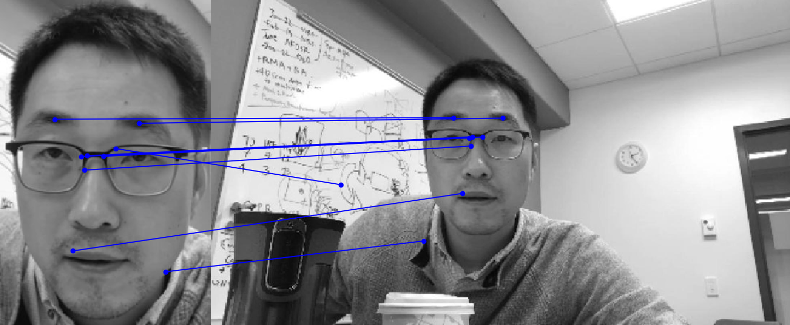
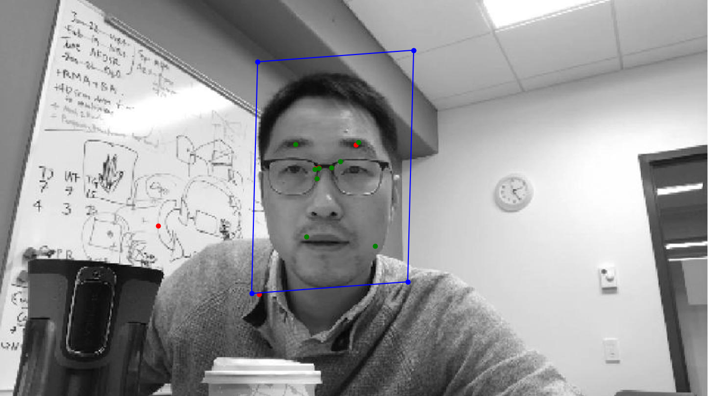
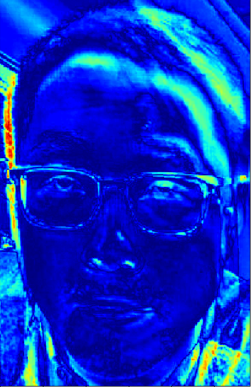
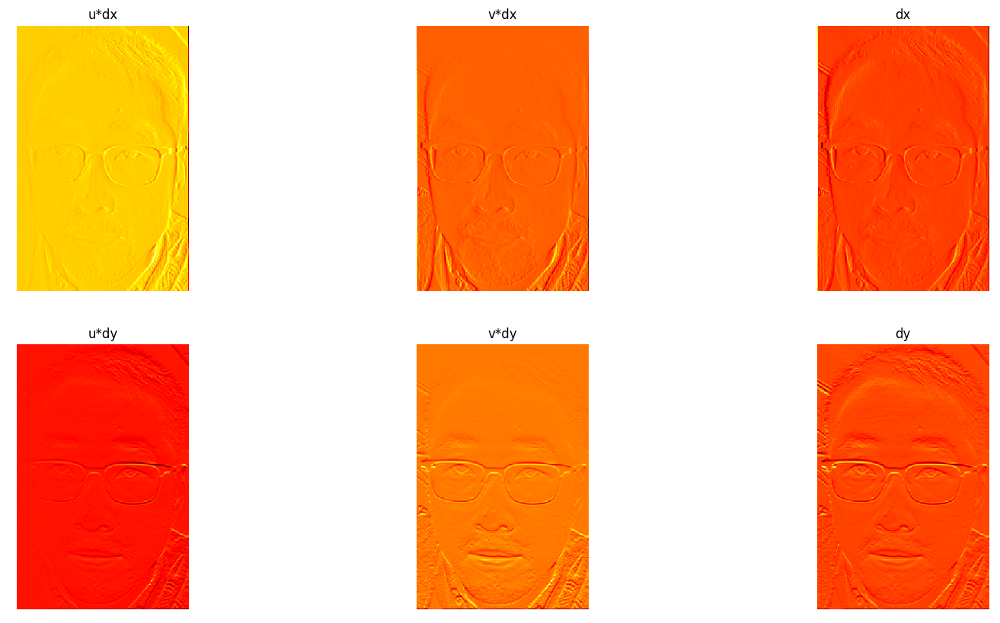
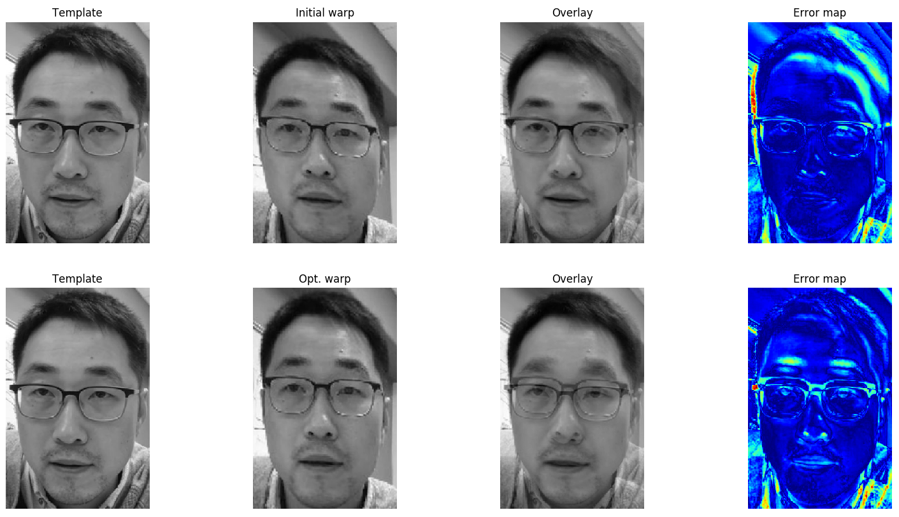
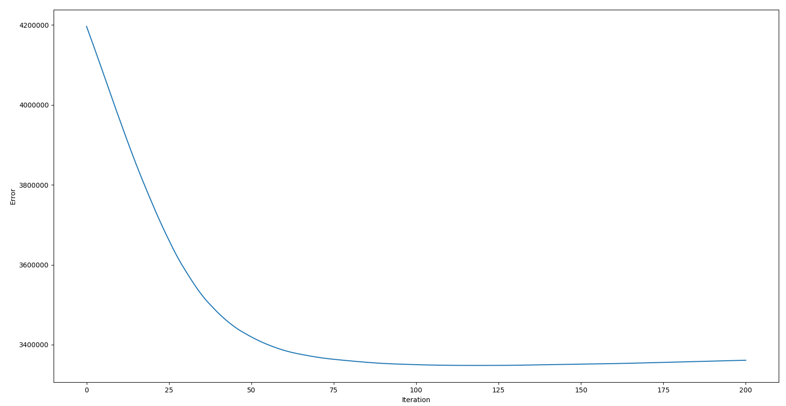

# image-registration

## description
- A simple image registration implementation.
- Uses SIFT/RANSAC based initialization and inverse compositional alignment based refinement.

## roadmap
- [x] `find_match`
    - [x] template -> target ?
    - [x] Any bi-directional consistency checks needed ?
- [x] cross check correctness of `align_image_with_feature`
- [x] inverse compositional warp
- [x] report
- [x] bilinear interpolate
- [x] multiframe tracking

Problems in `hw2.pdf` are solved.

### takeaways
- Direction of differentiation filter is important, otherwise error may diverge rather than coverging.
- Bilinear-interpolation is also important.
- Number of iterations of ICA is important as steps are small (small hessian).
- Fucking start the homework well before the last day, got good results 30 mins after deadline!

## code
- All source code is in `Registration.py`.
- It reads from `targe{1,2,3,4}.jpg` and `template.jpg`.

## documentation
- Code is the documentation of itself.

## usage
- `python3 Registration.py`.
    - Aligns template image with each target image in order and prints results.
- A summary of the pipeline is given in `report.pdf`.

## demonstration
- The pipeline is illustrated below.

- SIFT feature extraction.

- SIFT feature matching.

- Project of template on target1 using RANSACed affine transform model.

| Warped target1 image on template domain | Error b/w them |
| --- | --- |
|  |  |

- Steepest descent matrix visualization.

- Refinement of inverse compositional alignment.

- Error vs iteration during inverse compositional alignment.

- Alignment repeated for multiple target images in order.

